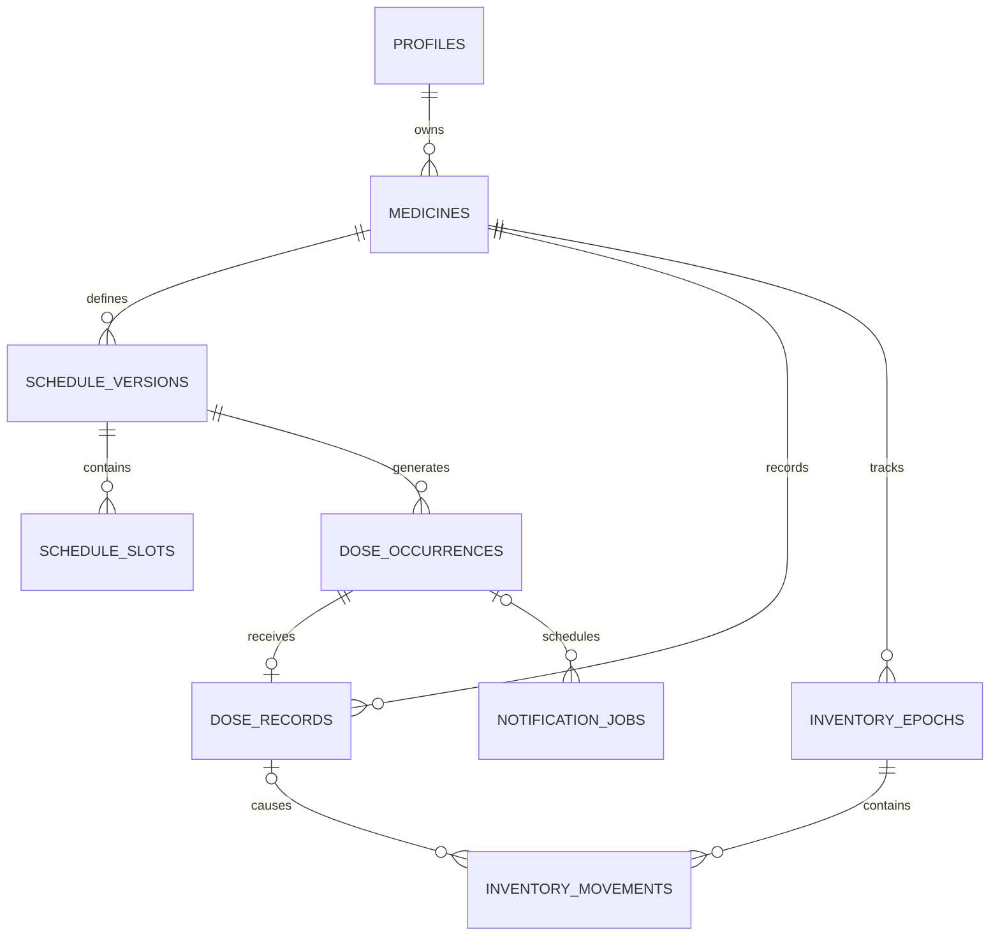
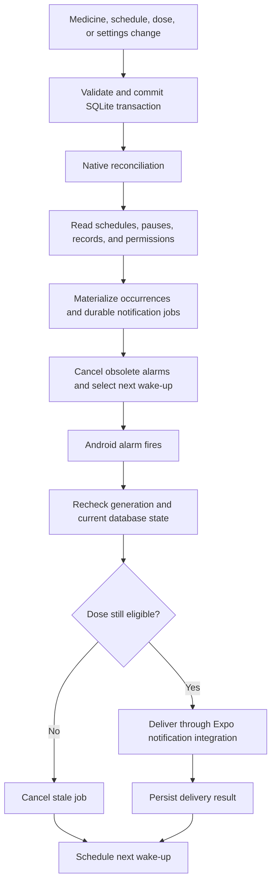
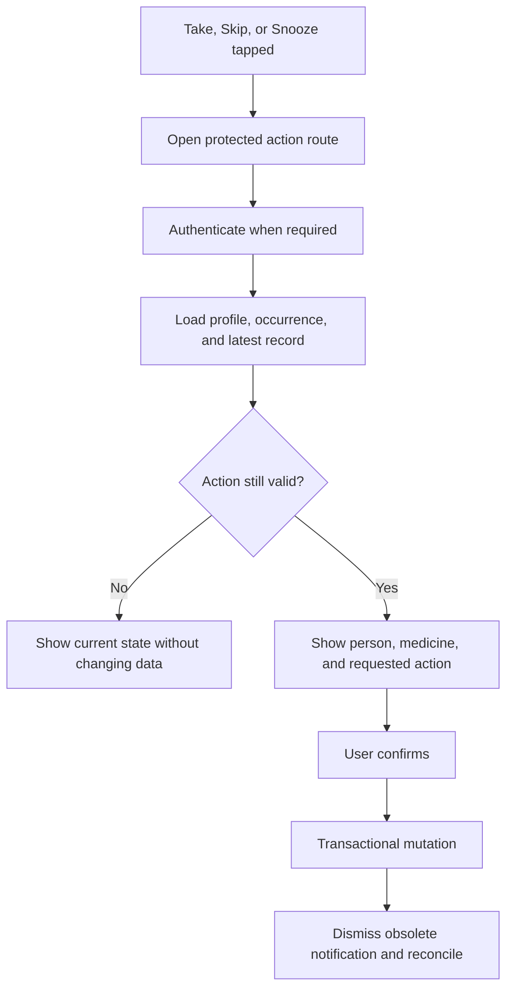

# DoseTracker — Product and Implementation Plan

**Document status:** Living product plan. Sections marked **Target** describe future architecture; the current implementation is summarized below and audited in [Settings architecture](docs/SETTINGS_ARCHITECTURE.md).

## Current implementation snapshot (September 2026)

- Expo SDK 57, Expo Router, NativeWind, app-private SQLite schema v4, and Today / History / Settings tabs are in place. The first-run onboarding flow is guarded by its persisted completion flag, and app lock gates health screens before they appear.
- Profiles, medicines, schedules, dose history, pending snoozes, and structured reminder setup issues live in `dosetracker.db`. Selected profile is `settings.active_profile_id`. Settings preferences and onboarding state currently live in separate AsyncStorage keys; app-lock state lives in `expo-secure-store`. The SQLite `settings.notification_preferences` default is legacy and is not read by the Settings UI.
- Ongoing daily and selected-weekday medicine reminders use `expo-notifications`; as-needed schedules have no alarm. Future-start, bounded-course, day-interval, and hour-interval alarms still need implementation. Snooze reads the saved 5/10/15/30-minute choice, stores an occurrence deadline in SQLite, and schedules a native one-shot request. Snooze is an in-app Today action after opening a notification; there is no notification-tray Snooze action.
- Android `SCHEDULE_EXACT_ALARM` and `POST_NOTIFICATIONS` are declared in `app.json`. The local `DoseAlarmAccess` module checks exact-alarm access, opens the OS access page, opens app-specific notification settings, and re-arms Expo requests on relevant system events. Expo SDK 57 schedules exact allow-while-idle alarms when Android grants access and uses an inexact fallback otherwise. Onboarding and Reminder status guide users through both permission paths.
- Settings has dedicated notification privacy, sound/vibration, device authentication, and reminder status screens; the snooze picker is a bottom sheet. Privacy modes redact notification content as well as request Android `PUBLIC`, `PRIVATE`, or `SECRET` channel visibility. The two bundled chimes need a native build and can be previewed. A real medication-style test notification is scheduled after ten seconds. Reminder status reads native permissions/queued requests and seven days of observed SQLite setup issues; it cannot infer an individual missed delivery from deep sleep.
- A Pixel 9 emulator build verified the native sound resources, silent/vibration-off channels, redacted test notification, and direct Android settings links. Typecheck, lint, the Node tests, and Expo Doctor passed. This does not validate release builds, physical devices, Doze reliability, or an exact-delivery guarantee.

**Critical remaining requirement:** Exact on-time delivery and recovery for every supported medication schedule remain unproven. Android special access and an exact alarm request improve timing, but the OS and device restrictions can still intervene. The target durable `notification_jobs` scheduler, per-occurrence recovery, broader recurrence, and physical-device tests below remain open work.

## 1. Product definition

DoseTracker is a free, local-first Android medication management application intended for eventual public Play Store distribution.

The application must operate entirely offline after installation. Profiles, medicines, schedules, dose history, stock information, and preferences remain on the device unless the user explicitly exports them.

### Technology

- Expo SDK 57 and React Native, using the existing root project.
- TypeScript with strict checking.
- Expo Router for navigation.
- Three native tabs: **Today**, **History**, and **Settings**.
- NativeWind 4.2.7 with Tailwind CSS 3.
- `expo-sqlite` for persistent application data.
- `expo-notifications` for current scheduling, channels, and notification presentation; protected notification actions remain planned.
- A local Expo Android module currently checks exact-alarm access, opens Android settings, and re-arms Expo requests after system events. A durable native scheduler remains a target.
- `expo-local-authentication` and `expo-secure-store` for device app lock; `expo-audio` and bundled notification sounds for reminder previews.
- EAS development, preview APK, and production App Bundle builds remain release targets; current device verification used a local Android development build.
- npm, with dependencies installed through `npx expo install`.

Keep non-route code outside `src/app/`. Configure native behavior using Expo modules and config plugins; do not hand-edit generated Android or iOS projects.

Preserve existing user changes and leave the unrelated `vericode/` directory untouched.

### Explicit exclusions

Version one does not include:

- Accounts, cloud synchronization, ads, purchases, analytics, or remote medication lookup.
- Medical advice, dose recommendations, interaction checking, or automatic unit conversion.
- Tapering courses or partial-dose remainder tracking.
- Shared household stock.
- Widgets, barcode scanning, medicine photos, PDF reports, or adherence trend charts.
- Prescriber fields or prescription/supplement categories.
- iOS or web release commitments.
- Play Store publication as part of initial implementation.

## 2. Visual direction and interaction principles

Use both user-provided UI references, including the additional Today dashboard.

### Visual system

- Warm ivory page backgrounds.
- White cards with generous rounded corners.
- Dark navy primary actions and selected navigation states.
- Subtle shadows and comfortable spacing.
- Restrained green, amber, red, and blue status accents.
- Pill-shaped instruction badges.
- Clear typography and readable secondary text.
- A compact circular daily-progress indicator.

This visual direction replaces the earlier generic teal-first proposal.

### Required refinements

- Use a consistent native bottom bar with three labeled tabs.
- Keep the selected person visible throughout medication and dose workflows.
- Distinguish medicine strength from the amount to take: for example, “10 mg tablet” and “Take 1 tablet.”
- Use icons and labels alongside status colors.
- Avoid duplicated low-stock warnings.
- Avoid charts with inconsistent time periods or unexplained statistics.
- Ensure progress totals match the visible records.
- Support large system text, TalkBack, safe areas, keyboard avoidance, and accessible touch targets.
- Support System, Light, and Dark appearance; System is the default.
- Use English with device date, week-start, and 12/24-hour preferences.

## 3. Functional requirements

### Profiles

- Support multiple local profiles.
- Show one profile at a time and remember the last selection.
- Fields: name, color/avatar, optional photo, date of birth, and personal notes.
- Obtain profile photos through the device photo picker and copy them into app-private storage.
- Show overdue-count badges for other people in the profile switcher.
- Support creating, editing, archiving, restoring, and permanently deleting profiles.
- Archiving stops reminders and preserves history.
- Permanent deletion removes the profile and its associated data after confirmation.

### Medicines

Store:

- Name.
- Strength as descriptive text.
- Form.
- Dose amount and unit.
- Purpose.
- Instructions.
- Color/icon.
- Notes.
- Optional inventory information.

Medicine management is accessible from Today.

Use a four-step creation flow:

1. Details.
2. Schedule.
3. Optional stock.
4. Review.

Allow editing, pausing, resuming, archiving, restoring, and permanent deletion.

### Schedule types

| Type | Behavior |
|---|---|
| Daily | One or more fixed local times every day. |
| Selected weekdays | One or more fixed local times on selected weekdays. |
| Every N days | Calendar-day recurrence anchored to the chosen start date. |
| Every N hours | Elapsed-hour recurrence anchored to a chosen instant; includes overnight doses. |
| As needed | No scheduled occurrences or dose reminders. |

Additional rules:

- Fixed-time schedules may use different amounts at different times.
- Hourly schedules use one amount.
- Logging late never shifts future scheduled doses.
- A course has a start date and either no end, an inclusive end date, or a duration in days.
- Automatic tracking starts today or on a future date.
- Older doses can be entered manually without creating historical missed doses.
- Schedule edits take effect now or tomorrow, defaulting to now.
- Preserve previous schedule versions and historical records.
- Pauses can have an optional automatic-resume date.
- Paused periods create no expected doses and do not count against progress.
- Resumption follows the original recurrence without catch-up doses.

### Dose actions

- **Take:** record the planned amount at the current time and offer Undo.
- **Take early:** require confirmation showing the planned time.
- **Skip:** record an explicit skipped status; reason is optional.
- **Snooze:** choose 5, 10, 15, 30, or 60 minutes.
- Notification snoozing uses a global default, initially 10 minutes.
- Snoozing must finish before both midnight and the next scheduled dose of that medicine.
- Unanswered reminders do not repeat automatically.
- Allow editing actual time, amount, and notes.
- Allow undoing taken/skipped records and backfilling historical doses.
- Allow separately labeled extra doses of scheduled medicines.
- Extra and as-needed doses affect inventory and history without completing or shifting scheduled doses.

### Status and progress rules

For an active scheduled occurrence:

1. An existing non-voided taken record means **Taken**.
2. An existing non-voided skipped record means **Skipped**.
3. Otherwise, after its scheduled day ends, it is **Missed**.
4. Otherwise, after its scheduled time, it is **Overdue**.
5. Otherwise, it is **Upcoming**.

“Due now” is a presentation label for a recently due occurrence.

Snoozing changes reminder timing, not the planned dose time or completion status.

Daily progress:

```text
taken scheduled occurrences / expected scheduled occurrences
```

Skipped doses remain in the denominator. Paused/cancelled occurrences, extra doses, as-needed doses, and manual pre-tracking history are excluded.

### Inventory

- Inventory is optional and separate for each person’s medicine.
- Use the same unit for dosing and inventory.
- Deduct the amount actually recorded.
- Support refills and manual stock counts.
- Correct inventory when a dose is edited or undone.
- Allow negative balances and display a discrepancy warning.
- Never block recording a dose because stock is insufficient.
- Notify when stock crosses the user’s low-stock threshold.
- Re-arm the alert after stock rises above that threshold.
- Show one concise low-stock warning per medicine.

## 4. Target SQLite database design

The following expanded schema is a future design, not the current `src/database.js` schema v4. Current tables include `profiles`, `medicines`, `schedules`, `history`, `dose_snoozes`, `settings`, and `reminder_issues`. Do not write new code against the proposed tables until migrations create them. Current Settings and onboarding preferences are in AsyncStorage, and the Android module does not read SQLite directly.

### Storage conventions

- Database name: `dosetracker.db`.
- IDs: UUID strings stored as `TEXT`.
- Instants: UTC Unix milliseconds stored as `INTEGER`.
- Calendar dates: ISO `YYYY-MM-DD` stored as `TEXT`.
- Local times: integer minutes after midnight, `0–1439`.
- Time zones: IANA identifiers.
- Booleans: integers constrained to `0` or `1`.
- Quantities: integer millionths of the medicine’s unit, using suffix `_q`.
- Example: `1 tablet = 1000000`; `0.5 tablet = 500000`.
- Accept at most six decimal places and reject values exceeding safe integer arithmetic; never silently round.
- Optional fields are nullable; other fields are required.
- Descriptive snapshots are application-validated JSON text.

Configure every database connection consistently:

```sql
PRAGMA foreign_keys = ON;
PRAGMA journal_mode = WAL;
PRAGMA busy_timeout = 5000;
```

Use versioned migrations and parameterized statements. Coordinate migrations with native scheduling so a receiver never reads a partially migrated schema.

The UI currently uses `expo-sqlite`. Direct database access from a future Android scheduler will require migration coordination and compatible SQLite connections.

### Relationships



### `profiles`

| Column | Type | Purpose |
|---|---|---|
| `id` | TEXT PK | Stable profile identity. |
| `name` | TEXT | Nonblank display name. |
| `avatar_color`, `avatar_icon` | TEXT | Built-in appearance choices. |
| `photo_path` | TEXT nullable | App-private relative image path. |
| `birth_date` | TEXT nullable | Calendar date. |
| `notes` | TEXT nullable | Personal or care notes. |
| `archived_at_ms` | INTEGER nullable | Current archive state. |
| `created_at_ms`, `updated_at_ms` | INTEGER | Audit timestamps. |

### `medicines`

| Column | Type | Purpose |
|---|---|---|
| `id` | TEXT PK | Stable medicine identity. |
| `profile_id` | TEXT FK | Owning profile. |
| `name` | TEXT | Nonblank medicine name. |
| `strength_text` | TEXT nullable | Descriptive strength. |
| `form`, `unit` | TEXT | Medicine form and dose/stock unit. |
| `purpose`, `instructions`, `notes` | TEXT nullable | Optional details. |
| `color`, `icon` | TEXT nullable | Appearance. |
| `low_stock_threshold_q` | INTEGER nullable | Nonnegative threshold. |
| `archived_at_ms` | INTEGER nullable | Current archive state. |
| `created_at_ms`, `updated_at_ms` | INTEGER | Audit timestamps. |

Once dose or stock records exist, changing the measurement unit requires a new medicine entry. This prevents silently reinterpreting historical quantities.

### `schedule_versions`

| Column | Type | Purpose |
|---|---|---|
| `id` | TEXT PK | Immutable schedule revision identity. |
| `medicine_id` | TEXT FK | Associated medicine. |
| `kind` | TEXT enum | `daily`, `weekdays`, `day_interval`, `hour_interval`, `prn`. |
| `effective_from_ms` | INTEGER | Inclusive revision start. |
| `effective_until_ms` | INTEGER nullable | Exclusive revision end. |
| `start_local_date` | TEXT | Course start and calendar-day anchor. |
| `end_local_date` | TEXT nullable | Inclusive course end. |
| `weekdays_mask` | INTEGER nullable | Monday is bit 0; Sunday is bit 6. |
| `every_n_days` | INTEGER nullable | Positive calendar-day interval. |
| `every_n_hours` | INTEGER nullable | Positive whole-hour interval. |
| `hourly_anchor_ms` | INTEGER nullable | Fixed anchor for hourly recurrence. |
| `default_amount_q` | INTEGER | Positive default/hourly amount. |
| `snapshot_json` | TEXT | Medicine details applicable to this revision. |
| `created_at_ms` | INTEGER | Creation time. |

Constraints:

- Effective date ranges cannot overlap for one medicine.
- An end must follow its start.
- Weekday schedules require a nonempty weekday mask.
- Interval schedules require the corresponding positive interval.
- Hourly schedules require an anchor.
- Unused recurrence fields remain null.
- The repository rejects overlapping revisions transactionally.

### `schedule_slots`

| Column | Type | Purpose |
|---|---|---|
| `id` | TEXT PK | Revision-specific slot identity. |
| `schedule_version_id` | TEXT FK | Parent revision. |
| `slot_key` | TEXT | Stable identity retained when editing a time slot. |
| `local_minute` | INTEGER | Time of day. |
| `amount_q` | INTEGER | Positive amount at that time. |

Enforce uniqueness of both `(schedule_version_id, local_minute)` and `(schedule_version_id, slot_key)`.

Daily, weekday, and day-interval schedules require at least one slot. Hourly and as-needed schedules do not use slots.

### `suppression_periods`

| Column | Type | Purpose |
|---|---|---|
| `id` | TEXT PK | Suppression identity. |
| `profile_id` | TEXT FK nullable | Whole-profile suppression. |
| `medicine_id` | TEXT FK nullable | Medicine suppression. |
| `reason` | TEXT enum | `pause` or `archive`. |
| `starts_at_ms` | INTEGER | Inclusive beginning. |
| `ends_at_ms` | INTEGER nullable | Exclusive ending. |
| `resume_local_date` | TEXT nullable | Optional local-date automatic resumption. |

Exactly one of `profile_id` and `medicine_id` must be set.

Retain closed periods so historical expected-dose calculations remain correct after resumption.

### `dose_occurrences`

Represents what was planned, independently of what the user recorded.

| Column | Type | Purpose |
|---|---|---|
| `id` | TEXT PK | Stable occurrence identity. |
| `medicine_id` | TEXT FK | Associated medicine. |
| `schedule_version_id` | TEXT FK | Originating revision. |
| `occurrence_key` | TEXT UNIQUE | Deterministic generation key. |
| `slot_key` | TEXT nullable | Fixed-time slot identity. |
| `sequence_index` | INTEGER nullable | Hourly occurrence index. |
| `scheduled_at_ms` | INTEGER | Resolved planned instant. |
| `scheduled_local_date` | TEXT | History/calendar grouping date. |
| `scheduled_local_minute` | INTEGER | Planned wall-clock time. |
| `time_zone` | TEXT | Zone used to resolve the occurrence. |
| `day_end_at_ms` | INTEGER | Boundary for becoming missed. |
| `planned_amount_q` | INTEGER | Planned quantity. |
| `snapshot_json` | TEXT | Historical name, strength, unit, form, and instructions. |
| `cancelled_at_ms` | INTEGER nullable | Removed from future expectations. |
| `cancellation_reason` | TEXT nullable | Edit, pause, archive, or equivalent reason. |
| `created_at_ms`, `updated_at_ms` | INTEGER | Audit timestamps. |

Calendar occurrence keys use revision, slot, and local date. Hourly keys use revision and sequence index.

Use a composite foreign key to ensure the schedule revision belongs to the same medicine.

Future unrecorded occurrences may be recalculated or cancelled. Past occurrences and recorded details must not be silently rewritten.

If a schedule edit would recreate a future dose already taken early, retain the original record and require the conflicting change to start tomorrow.

### `dose_records`

Represents explicit user actions.

| Column | Type | Purpose |
|---|---|---|
| `id` | TEXT PK | Stable record identity. |
| `medicine_id` | TEXT FK | Associated medicine. |
| `occurrence_id` | TEXT UNIQUE FK nullable | Planned dose, when applicable. |
| `kind` | TEXT enum | `scheduled`, `prn`, `extra`, `historical`. |
| `status` | TEXT enum | `taken` or `skipped`. |
| `actual_at_ms` | INTEGER nullable | Actual intake time for taken records. |
| `history_local_date` | TEXT | Display/grouping date. |
| `time_zone` | TEXT | Recording/intake zone context. |
| `amount_q` | INTEGER nullable | Actual amount for taken records. |
| `notes`, `skip_reason` | TEXT nullable | User annotations. |
| `snapshot_json` | TEXT | Historical descriptive details. |
| `inventory_epoch_id` | TEXT FK nullable | Inventory period affected. |
| `stock_debit_q` | INTEGER | Currently applied inventory deduction. |
| `revision` | INTEGER | Optimistic concurrency version. |
| `voided_at_ms` | INTEGER nullable | Undo/deletion of the user record. |
| `created_at_ms`, `updated_at_ms` | INTEGER | Audit timestamps. |

Constraints:

- Scheduled records require an occurrence; other kinds do not.
- Taken records require positive quantity and actual intake time.
- Skipped records have no actual quantity or intake timestamp.
- One record exists per occurrence; undo voids that record, and subsequent recording reuses it.
- Composite foreign keys prevent linking records to another medicine’s occurrence or inventory period.
- Missed and overdue are derived states, not fabricated user records.

### `inventory_epochs`

Represents a period beginning with a known physical stock count.

| Column | Type | Purpose |
|---|---|---|
| `id` | TEXT PK | Stock-period identity. |
| `medicine_id` | TEXT FK | Associated medicine. |
| `opened_at_ms` | INTEGER | Baseline time. |
| `closed_at_ms` | INTEGER nullable | End of this stock period. |
| `unit` | TEXT | Measurement-unit snapshot. |
| `low_stock_latched` | INTEGER boolean | Prevent repeated threshold notifications. |

Allow only one open epoch per medicine.

Enabling stock tracking or setting a new physical count opens a new epoch. Refilling adds to the current epoch.

Historical changes before the current physical-count baseline must not incorrectly change today’s stock.

### `inventory_movements`

| Column | Type | Purpose |
|---|---|---|
| `id` | TEXT PK | Ledger entry identity. |
| `epoch_id` | TEXT FK | Associated stock period. |
| `dose_record_id` | TEXT FK nullable | Related intake record. |
| `operation_key` | TEXT UNIQUE | Idempotency key. |
| `kind` | TEXT enum | `opening`, `refill`, `dose`, `correction`, `reversal`. |
| `delta_q` | INTEGER | Signed quantity change. |
| `notes` | TEXT nullable | Explanation. |
| `created_at_ms` | INTEGER | Bookkeeping timestamp. |

Current balance:

```sql
SELECT COALESCE(SUM(delta_q), 0)
FROM inventory_movements
WHERE epoch_id = ?;
```

Use compensating movements for edits and undo. Do not independently overwrite a cached balance.

### `notification_jobs`

| Column | Type | Purpose |
|---|---|---|
| `id` | TEXT PK | Job identity. |
| `generation` | TEXT | Installation/restore scheduling generation. |
| `kind` | TEXT enum | `dose`, `snooze`, `low_stock`, `recovery`, `test`. |
| `occurrence_id` | TEXT FK nullable | Related planned dose. |
| `medicine_id` | TEXT FK nullable | Related medicine. |
| `due_at_ms` | INTEGER | Intended delivery time. |
| `expires_at_ms` | INTEGER nullable | Latest useful delivery boundary. |
| `state` | TEXT enum | `queued`, `dispatching`, `delivered`, `cancelled`, `failed`. |
| `delivery_key` | TEXT UNIQUE | Stable OS-notification identity. |
| `attempt_count` | INTEGER | Delivery-attempt count. |
| `delivered_at_ms` | INTEGER nullable | Successful submission time. |
| `last_error_code` | TEXT nullable | Local diagnostic code. |
| `created_at_ms`, `updated_at_ms` | INTEGER | Audit timestamps. |

Validate dose/snooze jobs against an occurrence and its medicine. Do not store unnecessary medical text in notification action payloads.

### Supporting tables

| Table | Columns and purpose |
|---|---|
| `mutation_receipts` | `request_id TEXT PK`, operation, entity ID, result JSON, completion timestamp. Makes retried mutations idempotent. |
| `app_settings` | Proposed singleton row for selected profile, theme, snooze duration, detailed-notification preference, and onboarding completion. Migrate existing SQLite/AsyncStorage values deliberately before making this the source of truth. |
| `runtime_state` | Key/value JSON and update timestamp for scheduler generation, migration coordination, reconciliation cursors, and recovery state. |
| `clock_events` | ID, observed timestamp, IANA zone, UTC offset, reason. Records observed clock/time-zone transitions. |

Keep device-specific app-lock configuration in secure local storage. Never export authentication material or live OS permission state.

### Required indexes and deletion behavior

Index:

- Medicines by profile and archive state.
- Schedule revisions by medicine and effective start.
- Suppression periods by owner and start.
- Occurrences by local date, medicine, and scheduled instant.
- Active occurrences by scheduled instant.
- Dose records by history date and medicine.
- Inventory movements by epoch and timestamp.
- Notification jobs by state and due time.

Permanent profile/medicine deletion cascades through owned data. Clear a deleted selected profile. Rotate or invalidate affected notification identities before removing their database rows.

### Transaction boundaries

A Take, Skip, edit, undo, or stock operation performs the following in one transaction:

1. Check its request ID for an existing receipt.
2. Validate profile, medicine, occurrence, and record version.
3. Apply the dose-record change.
4. Apply inventory movements and threshold state changes.
5. Cancel or enqueue reminder jobs.
6. Write the mutation receipt and mark scheduling as requiring reconciliation.
7. Commit.
8. Reconcile OS alarms and refresh the UI.

Scheduling failures must not roll back a successfully recorded dose. Surface a reminder-status issue and retain repairable database state.

## 5. Target scheduling and notification logic

The interface, durable-job flow, and delivery checks in this section are planned work. Today's scheduler is `src/notificationManager.js` plus Expo's Android scheduling delegate; `DoseAlarmAccess` supplies permission/settings integration and system-event re-arming. Current status checks queued native requests and observed setup errors. Android does not expose a reliable receipt proving that each local notification was displayed or seen.

### Ownership

- SQLite is the source of truth.
- A future Android scheduler should implement the target recurrence and recovery engine; current occurrence logic is in JavaScript and only ongoing daily/weekday schedules become recurring native reminders.
- React Native requests previews and materialization through typed interfaces.
- Expo currently owns Android alarm wake-ups. The local module handles access checks, settings intents, and selected system-event recovery.
- `expo-notifications` handles notification integration and presentation.
- Do not depend on JavaScript timers or periodic app reopening.

The native integration with Expo notification internals must be isolated, version-pinned, and covered by build/device tests.

### Module interfaces

```ts
type ScheduleKind =
  | "daily"
  | "weekdays"
  | "day_interval"
  | "hour_interval"
  | "prn";

type ReminderStatus = {
  notificationsAllowed: boolean;
  channelEnabled: boolean;
  exactAlarmAllowed: boolean;
  schedulerHealthy: boolean;
  nextReminderAt: number | null;
  lastErrorCode: string | null;
};

interface DoseTrackerScheduler {
  initialize(databasePath: string, schemaVersion: number): Promise<void>;
  previewSchedule(input: SchedulePreviewInput): Promise<OccurrencePreview[]>;
  ensureOccurrences(fromMs: number, toMs: number): Promise<void>;
  reconcile(reason: ReconcileReason): Promise<ReminderStatus>;
  getStatus(): Promise<ReminderStatus>;
  cancelAll(): Promise<void>;
}
```

Schedule previews use the same recurrence implementation as real alarms.

### Main flow



Maintain a bounded projection, initially 30 days, and extend it during native reconciliation. Native wake-ups must also cover future start dates, pending schedule revisions, and automatic resumption so reminders never depend on a user refreshing that projection.

### Permission handling

- Create channels before requesting notification permission.
- Explain and request exact-alarm special access when needed.
- Use exact native wake-ups when access is granted.
- When exact access is unavailable, use the supported inexact fallback and show that reminders may be delayed.
- If notifications are disabled, preserve tracking and show actionable diagnostics.
- Recheck permission/channel state on app foregrounding and relevant system events.
- Do not claim a silent channel can be overridden.
- Do not bypass Do Not Disturb.

Use deterministic medicine-reminder channels for each supported sound/vibration/privacy preset: Android channel alert behavior cannot be modified after creation. Preserve app-level and channel-level system restrictions when preferences change. Refill and recovery channels remain future work.

### Delivery eligibility

Before presentation, verify:

- The scheduling generation is current.
- Profile and medicine still exist.
- No pause/archive period suppresses the occurrence.
- The course and effective schedule permit the dose.
- The dose is not taken or skipped.
- The job is not cancelled, expired, or already satisfied.
- Notification permissions permit delivery.

An OS notification and SQLite commit cannot form one atomic transaction. Use durable job state and stable notification IDs to repair interrupted delivery without creating multiple visible notifications for one dose.

### Notification actions



Private actions require device unlock where configured. If the device has no secure credential, explain that private action authentication requires configuring device security; ordinary unlocked in-app tracking remains available.

Snooze creates one replacement job and cancels the previous snooze job. It does not change the original planned time.

### Time behavior

- Calendar schedules follow the device’s local time zone.
- Hourly schedules preserve their absolute anchor and elapsed-hour spacing.
- Preserve historical planned times and date grouping.
- Rebuild only future unrecorded occurrences after a zone change.
- For nonexistent daylight-saving times, shift forward by the clock-change gap.
- For repeated times, use the first occurrence only.
- Prevent duplicate calendar occurrences when clocks move backward.
- Record observed clock changes.
- If Android prevented delivery of a time-zone event, use the last known zone until the next observed change; do not invent historical transitions.

### Recovery

Reconcile after:

- App startup and foregrounding.
- Schedule/dose/inventory mutations.
- Boot and app updates.
- Clock and time-zone changes.
- Relevant permission events.
- Backup restoration.
- Automatic pause resumption.

After interruption:

- Reconstruct overdue/missed state from persisted schedules and records.
- Send one privacy-preserving summary of today’s outstanding doses.
- Deduplicate that summary for the recovery event.
- Resume future reminders.
- Do not replay every obsolete reminder.

Android may stop delivery while the phone is off, the application is force-stopped, permissions are revoked, or device restrictions intervene. The app must explain observable problems and repair scheduling when it can run again.

## 6. Screen definitions and target additions

The main Today, History, Settings, onboarding, profile, and reminder Settings routes exist. The tree and secondary-screen rows below also include planned routes that have not been implemented; see the current snapshot and [Settings architecture](docs/SETTINGS_ARCHITECTURE.md) before assuming a route exists.

### Navigation structure

```text
Root Stack
├── Onboarding
├── App Lock / Protected Action
├── Native Tabs
│   ├── Today
│   ├── History
│   └── Settings
├── Medicines
├── Medicine Details
├── Medicine Wizard
├── Dose Details / Edit
├── Manual Dose Log
├── Profiles / Profile Editor
├── Reminder Status
├── Backup Export / Restore
└── Supporting confirmation sheets
```

### Main screens

| Screen | Contents | Primary actions |
|---|---|---|
| Today | Profile selector, date, taken/planned progress, overdue/due, upcoming and completed groups, as-needed access. | Take, Skip, Snooze, Medicines, Add Medicine. |
| History | Profile selector, calendar, legend, date range, medicine/status filters, chronological records. | Open/edit record, add historical record, export filtered CSV. |
| Settings | Profiles, appearance, reminders, privacy, data management, About. | Configure preferences, test reminders, backup/restore, erase data. |
| Medicines | Search and Active/Paused/Archived/As-needed filters; medicine cards. | Open medicine, add medicine. |
| Medicine Details | Details, schedule, course, inventory, recent logs, lifecycle actions. | Log dose/refill, edit, pause/resume, archive/delete. |

### Forms and secondary screens

| Screen | Definition |
|---|---|
| Profile switcher | Names, avatars, current selection, and other profiles’ overdue counts. |
| Profile editor | Name, avatar/color, optional photo, birth date, notes. |
| Medicine Details step | Name, strength, form, dose unit, purpose, instructions, icon/color, notes. |
| Medicine Schedule step | Recurrence selection, times/amounts, start date, end/duration. |
| Medicine Stock step | Optional tracking, current quantity, low-stock threshold. |
| Medicine Review step | Plain-language summary identifying the profile and complete schedule. |
| Dose details/edit | Planned versus actual time, amount, status, notes, optional skip reason, correction/undo actions. |
| Manual dose log | Medicine, actual date/time, amount, optional notes; explicit as-needed/extra/historical label. |
| Snooze sheet | Allowed duration choices and reasons for unavailable choices. |
| Early-dose confirmation | Person, medicine, amount, planned time, and current recording time. |
| Pause sheet | Pause now, optional resume date, and explanation that paused doses are excluded. |
| Refill sheet | Quantity added and optional note. |
| Stock correction | New physical count; explain that it establishes a new stock baseline. |
| Reminder status | Implemented: enabled/queued status, notification/channel permission, exact-alarm access, seven-day observed setup issues, and Android settings links. Next-reminder time and per-occurrence delivery state remain planned. |
| Protected notification action | Authentication gate followed by explicit person/medicine/action confirmation. |
| Backup export | Included data and explanation that the file is unencrypted. |
| Restore preview | Backup date, profile/medicine counts, compatibility result, replacement warning. |
| About | Version, offline behavior, local privacy information, reminder limitations. |

### Settings defaults

| Setting | Default |
|---|---|
| Appearance | System |
| Snooze | 10 minutes |
| Notification details | Show content (current default); Hide sensitive content and No info are available. Revisit the privacy default before release. |
| App lock | Disabled until enabled |
| App-lock delay | Immediate |
| Sound/vibration | Phone default sound and vibration on; independent sound and vibration controls use preset Android channels. |
| History retention | Indefinite |
| Automatic cloud backup | Disabled |

### Required states

Design and implement:

- First-run introduction and profile creation.
- No medicines.
- Nothing scheduled today.
- All scheduled doses completed.
- No matching history.
- Paused/archived medicine.
- Permission denied or channel disabled.
- Stock discrepancy.
- Invalid form input.
- Database initialization or migration failure.
- Failed scheduling with successful dose recording.
- Invalid/unsupported backup.
- Restore failure with original data preserved.

## 7. Privacy, export, and restoration

Current export/restore handles validated preferences only. The full data backup, staged transactional restore, CSV export, and several privacy/release checks below are target requirements. Device app lock already uses SecureStore and protects recent-app previews; Erase all data removes the app-owned database, preferences, local profile photos, onboarding flag, and secure app-lock flag.

### Privacy

- No remote account, analytics, crash-upload, medication lookup, or synchronization service.
- Bundle required assets and explanatory content.
- Disable production automatic update checks.
- Review release dependencies for unintended network initialization.
- Keep medical data in app-private storage.
- Disable automatic cloud backup and automatic transfer of app data.
- An explicit system share/export action remains available.
- App lock is an access gate, not a claim that backup files or the entire database are encrypted.
- Protect recent-apps previews when app lock is enabled.
- Avoid medical details in diagnostic logs.

### Full backup format

Use a versioned UTF-8 JSON document:

```ts
type DoseTrackerBackup = {
  format: "dosetracker-backup";
  formatVersion: 1;
  schemaVersion: number;
  exportedAt: string;
  appVersion: string;
  data: PortableDatabaseData;
  photos: Array<{
    id: string;
    mimeType: "image/jpeg" | "image/png";
    base64: string;
  }>;
};
```

Include profiles, medicine metadata, schedule history, suppressions, occurrences, records, inventory ledgers, clock history, and portable preferences.

Exclude:

- OS notification jobs and live alarm identifiers.
- Mutation receipts.
- Runtime scheduling state.
- Device credentials and authentication state.
- OS permission state.

### Restore sequence

1. Read and validate without modifying live data.
2. Reject unsupported formats, broken references, invalid quantities, and unsafe photo paths.
3. Stage decoded photos in app-private storage.
4. Present a replacement preview.
5. Obtain explicit confirmation.
6. Suspend native reconciliation and invalidate old alarm generation.
7. Replace database contents transactionally.
8. Switch to validated staged photo references.
9. Reinitialize device-specific settings safely.
10. Rebuild future occurrences and reminders.
11. Resume scheduling and remove obsolete staged/old files.

If the transaction fails, retain the original data and restore its scheduling. Do not leave an empty application.

### CSV export

Export the selected profile and active History filters.

Include:

- Profile.
- Medicine.
- Strength.
- Record type.
- Planned date/time when applicable.
- Actual date/time when applicable.
- Status.
- Amount and unit.
- Notes and skip reason.

Use UTF-8, correct quoting, and spreadsheet-formula-injection protection for user-entered text.

## 8. Implementation sequence

Current phase status:

| Phase | Status in repository |
|---|---|
| 1. Foundation and reminder feasibility | Partly complete: local Android development build, exact/inexact code path, channels, and permission UI verified on an emulator. Process-death, reboot, Doze, two-device and release-build validation remain. |
| 2. Persistence and domain behavior | Partly complete: SQLite v4 profiles/medicines/schedules/history/snoozes/issue logs. Versioned schedule revisions, durable notification jobs, inventory ledgers and full recurrence remain. |
| 3. Primary screens | Partly complete: guarded first-run onboarding, tabs, Settings sub-screens, profile and medicine basics. Remaining target screens and accessibility checks are listed above. |
| 4. Reliability and privacy | Partly complete: app lock, Android preview protection, preference-only export/restore, real test reminders, and observed-issue status. Full recovery, protected notification actions, and full backups remain. |
| 5. Release preparation | Open: physical-device and release-build validation, full offline audit, EAS preview/production configuration, and distribution materials. |

### Phase 1 — Foundation and reminder feasibility

- Configure NativeWind, root navigation, design tokens, and dependencies.
- Establish the local Expo module and config plugin.
- Build a development client.
- Verify exact/inexact alarms, process termination, reboot, protected actions, and Expo notification integration on Android.
- Pin the working native integration before building the remaining feature set.

### Phase 2 — Persistence and domain behavior

- Implement migrations and repositories.
- Implement profiles and medicine metadata.
- Implement schedule versions, occurrence generation, and suppression periods.
- Implement transactional dose recording, corrections, and inventory ledgers.
- Add deterministic fixtures and integrity tests.

### Phase 3 — Primary screens

- Implement onboarding.
- Implement Today, History, and Settings.
- Implement medicine/profile management and the medicine wizard.
- Implement dose actions and secondary sheets.
- Apply accessibility and dark mode.

### Phase 4 — Reliability and privacy

- Complete native reconciliation and recovery.
- Add reminder diagnostics and test notifications.
- Implement app lock and private actions.
- Add backup, restoration, CSV, and destructive-action confirmations.

### Phase 5 — Release preparation

- Run automated and physical-device validation.
- Verify complete operation in airplane mode.
- Configure preview APK and production AAB builds.
- Prepare app icon, splash screen, bundled privacy information, and release documentation.
- Keep Play Store submission separate.

## 9. Validation and acceptance criteria

### Database and mutation tests

- Migrations preserve existing data.
- A record cannot refer to another medicine’s occurrence.
- Only one user record exists per occurrence.
- Duplicate action requests do not double-deduct stock.
- Edits and undo apply correct compensating inventory movements.
- A new physical count isolates current stock from older bookkeeping changes.
- Profile deletion removes only that profile’s data.
- Selected-profile references are cleared safely.
- Backup restoration preserves relational integrity.

### Recurrence tests

- Daily, weekday, day-interval, hourly, and as-needed behavior.
- Multiple times with distinct amounts.
- Month/year boundaries and leap days.
- Inclusive course end dates and durations.
- Pauses, automatic resumption, archive/restore.
- Now/tomorrow edits.
- Early-taken future doses during schedule changes.
- Midnight status changes and snooze boundaries.
- Daylight-saving gaps and repeated times.
- Time-zone travel and backward clock changes.
- Long periods without opening the UI.

### Notification tests

Test release-like builds on a physical Pixel and at least one other manufacturer’s device:

- Foreground, background, process termination, and idle behavior.
- Reboot and app update.
- Notification/exact-alarm denial, revocation, and regrant.
- Disabled channel and silent/DND settings.
- Multiple profiles and simultaneous doses.
- Take, Skip, and Snooze through protected actions.
- Expired and stale notification actions.
- Course termination and automatic resumption while the UI remains closed.
- Recovery summary without notification flooding.
- Interrupted delivery and reconciliation.

### UI and privacy tests

- All core workflows in airplane mode.
- Large text and TalkBack.
- Long medicine names and extensive histories.
- Light and dark themes.
- Correct profile identity during every action.
- App-lock transitions and recent-apps protection.
- Private versus detailed notifications.
- Cancellation of authentication produces no dose mutation.
- Accurate progress and calendar markers.
- Correct filtered CSV output.

### Required completion checks

```bash
npx expo lint
npx tsc --noEmit
npx expo-doctor
```

Also run domain tests, native scheduling tests, migration/backup tests, and Android release-build smoke tests.

The TypeScript and lint scope should cover the root application without unintentionally treating the unrelated nested project as part of DoseTracker.

### Validation performed so far

The repository's Node tests cover the implemented schema/migrations, dose and snooze behavior, reminder content/channels, permission handling, and reconciliation. A Pixel 9 Android emulator development build verified native sound/vibration channels, a delivered test reminder, and Android notification/exact-alarm settings links. `npx expo lint`, `npx tsc --noEmit`, and `npx expo-doctor` passed after the reminder Settings work. The proposed expanded schema also had earlier in-memory design checks for:

- Schema creation and foreign-key validity.
- Duplicate schedule-time rejection.
- Cross-medicine schedule/record rejection.
- One active inventory period per medicine.
- Duplicate dose-record rejection.
- Inventory arithmetic.
- Profile deletion and isolation of surviving profiles.

Those earlier design checks do not validate the expanded schema in a shipped app. Physical-device alarm timing, background recovery, release builds, and the unimplemented architecture above remain open acceptance criteria.

## 10. Technical references

- [Expo SDK 57](https://docs.expo.dev/versions/v57.0.0/)
- [Expo SQLite](https://docs.expo.dev/versions/v57.0.0/sdk/sqlite/)
- [Expo Notifications](https://docs.expo.dev/versions/v57.0.0/sdk/notifications/)
- [Expo Router native tabs](https://docs.expo.dev/versions/v57.0.0/sdk/router/native-tabs/)
- [Expo custom native code](https://docs.expo.dev/workflow/customizing/)
- [Expo Local Authentication](https://docs.expo.dev/versions/v57.0.0/sdk/local-authentication/)
- [NativeWind installation and SDK 57 support](https://www.nativewind.dev/docs/getting-started/installation)
- [Android alarm scheduling](https://developer.android.com/develop/background-work/services/alarms)
- [Android force-stop behavior](https://developer.android.com/about/versions/15/behavior-changes-all)

Consult the matching versioned documentation before implementation and again when upgrading dependencies.
