# DoseTracker — Senior Android Developer & UX/QA Audit Report

**Application**: DoseTracker (`com.vericode.dosetracker`)  
**Target Platform**: Android (Tested on Google Pixel 9, Android 15 / API 35, 1080x2424, 420 dpi)  
**Evaluation Role**: Senior Android Engineer & Lead Mobile QA / UX Architect  
**Test Scope**: 100% End-to-End Walkthrough (Onboarding, Profiles, Permissions, Today Dashboard, Add Medicine Wizard, Medicine Management, Adherence History, Settings & Theming, Android System Notifications & Alarms).

---

## 1. Executive Summary & UX Scorecard

DoseTracker demonstrates solid domain-specific fundamentals: clear information architecture, zero network latency dependency (local SQLite `dosetracker.db`), privacy-first local data storage, and custom native alarm integration via `modules/dose-alarm-access`.

However, from a Senior Android Developer and QA perspective, the application currently presents critical layout regressions, broken design-system tokens, missing Android-specific ergonomics, and an absence of tactile feedback (haptics and fluid micro-animations).

### Senior UX & Engineering Scorecard

| Domain | Score (/10) | Rating | Key Summary |
| :--- | :---: | :---: | :--- |
| **Visual Design & Typography** | 7.5 / 10 | Good | Clean color palette and hierarchy, but suffers from hardcoded light colors and severe fold clipping. |
| **Dark Theme Architecture** | 2.0 / 10 | Critical Failure | Theme toggle only applies inline styles to `SettingsHomeScreen`. Tab bar and all other screens remain 100% white. |
| **Touch Responsiveness & Ergonomics** | 5.5 / 10 | Needs Improvement | Zero haptic feedback; bottom action bar in Add Medicine step 4 is pushed off-screen into the gesture navigation pill. |
| **Form Entry & Data Validation** | 6.0 / 10 | Fair | Manual text input for dates/times without native pickers; optional stock step throws an unexpected error by default. |
| **Animations & State Transitions** | 4.0 / 10 | Poor | Instant jump-cuts on dose completion; no circular progress bar smoothing; no celebratory feedback on 100% adherence. |
| **Android OS & System Integration** | 7.0 / 10 | Acceptable | Native exact-alarm permissions redirect works reliably, but system notifications lack actionable buttons (`[Take]`, `[Snooze]`). |
| **Navigation & Gesture Safety** | 5.0 / 10 | At Risk | Android hardware/gesture back press in multi-step wizard exits the entire screen rather than stepping back, causing data loss. |

---

## 2. Critical Defects & UX Blockers (Severity P0)

### 🔴 P0-1: Catastrophic Button Overflow in Add Medicine Step 4 (Review & Save)
* **File Affected**: [`src/features/medicines/AddMedicineScreen.tsx`](file:///Users/shome/Documents/Projects/DoseTrackerApp/src/features/medicines/AddMedicineScreen.tsx)
* **Observed Defect**:
  In Step 4 ("Review and save"), the parent container layout calculation fails to properly flex-shrink the summary card. As a result, the bottom navigation container holding the **"Back"** and **"Save Medicine"** buttons is pushed almost entirely below the physical screen boundary.
* **User Impact**:
  Only ~10–15 pixels of the top rim of the buttons are visible. On modern Android devices with gesture navigation (Pixel 9, Samsung Galaxy), touching this region triggers the Android OS Home gesture bar or is ignored by touch dispatchers. Users cannot reliably commit new medicines without repeated frustrated swiping.
* **Root Cause**:
  The `ScrollView` wrapping Step 4 lacks `flex: 1` inside the `KeyboardAvoidingView` wrapper, and the footer is placed inside the scrolling container without sticky positioning or proper bottom inset padding against `useSafeAreaInsets().bottom`.
* **Fix**:
  Extract the button footer outside of the `ScrollView` into a fixed sticky footer at the bottom of `AddMedicineScreen.tsx`, padded with `insets.bottom + 16`. Ensure the `ScrollView` has `flex: 1` and `contentContainerStyle={{ paddingBottom: 32 }}`.

```tsx
// Recommended layout structure:
<KeyboardAvoidingView style={{ flex: 1 }}>
  <ScrollView style={{ flex: 1 }} contentContainerStyle={{ paddingBottom: 24 }}>
    {renderCurrentStep()}
  </ScrollView>
  <View style={[styles.stickyFooter, { paddingBottom: Math.max(insets.bottom, 16) }]}>
    <Pressable onPress={handleBack} style={styles.backBtn}>...</Pressable>
    <Pressable onPress={handleNext} style={styles.primaryBtn}>...</Pressable>
  </View>
</KeyboardAvoidingView>
```

---

### 🔴 P0-2: Broken Dark Mode System Architecture & Blinding Contrast Collisions
* **Files Affected**:
  - [`src/features/settings/SettingsHomeScreen.tsx`](file:///Users/shome/Documents/Projects/DoseTrackerApp/src/features/settings/SettingsHomeScreen.tsx)
  - [`src/app/(tabs)/_layout.tsx`](file:///Users/shome/Documents/Projects/DoseTrackerApp/src/app/(tabs)/_layout.tsx)
  - [`src/features/today/TodayHomeScreen.tsx`](file:///Users/shome/Documents/Projects/DoseTrackerApp/src/features/today/TodayHomeScreen.tsx)
  - [`src/features/medicines/MedicinesListScreen.tsx`](file:///Users/shome/Documents/Projects/DoseTrackerApp/src/features/medicines/MedicinesListScreen.tsx)
  - [`src/features/history/HistoryScreen.tsx`](file:///Users/shome/Documents/Projects/DoseTrackerApp/src/features/history/HistoryScreen.tsx)
* **Observed Defect**:
  1. Setting Appearance to **Dark** in Settings changes *only* the internal container of `SettingsHomeScreen` (using local ternary checks like `isDark ? '#0B1522' : '#FBF8F3'`).
  2. The bottom navigation bar in `src/app/(tabs)/_layout.tsx` is hardcoded to `#FFFFFF` with border `#E5E7EB`. In dark mode, a glaring white bar sits underneath a dark navy screen.
  3. Switching tabs to **Today**, **Medicines**, or **History** reveals that none of these screens consume the theme preference. They remain entirely in daytime light mode (`#F8F9FA`, `#FFFFFF`).
  4. In `SettingsHomeScreen.tsx` (line 154), the icon for "System" is hardcoded to Feather `'check'`:
     ```tsx
     <Feather name="check" size={16} color={palette.accent} />
     ```
     This causes a persistent checkmark to be drawn next to "System" even when "Dark" or "Light" is actively selected.
* **User Impact**:
  In a dark environment, switching to Dark mode causes jarring, eye-straining contrast flashes between tabs and makes the app look unfinished.
* **Fix**:
  1. Build a unified `ThemeProvider` or expose `useThemeColor()` leveraging `useSettings().prefs.theme` and React Native's `useColorScheme()`.
  2. Pass dynamic theme colors to the `Tabs` navigator in `src/app/(tabs)/_layout.tsx` (`tabBarStyle: { backgroundColor: colors.surface, borderTopColor: colors.border }`).
  3. Connect all feature screens to semantic tokens (`colors.background`, `colors.surface`, `colors.textPrimary`, `colors.textMuted`).
  4. Conditionally render the checkmark in the theme selector: `{prefs.theme === 'system' && <Feather name="check" ... />}`.

---

### 🔴 P0-3: Android Hardware/Gesture Back Navigation Erases Multi-Step Form Progress
* **Files Affected**:
  - [`src/features/medicines/AddMedicineScreen.tsx`](file:///Users/shome/Documents/Projects/DoseTrackerApp/src/features/medicines/AddMedicineScreen.tsx)
  - [`src/app/profile.tsx`](file:///Users/shome/Documents/Projects/DoseTrackerApp/src/app/profile.tsx)
* **Observed Defect**:
  When a user is on Step 2, 3, or 4 of the Add Medicine wizard and triggers the native Android back gesture (or taps the Android system back button), the screen immediately pops off the navigation stack, discarding all entered medicine dosages, times, and inventory data without confirmation.
* **User Impact**:
  Users accustomed to Android's hierarchical back model expect the back gesture to return to the previous step in the wizard (Step 3 -> Step 2 -> Step 1) or prompt before discarding entered clinical data.
* **Fix**:
  Intercept back events using React Native's `BackHandler`:
  ```tsx
  useEffect(() => {
    const onBackPress = () => {
      if (currentStep > 1) {
        setCurrentStep((prev) => prev - 1);
        return true; // prevent default pop
      }
      // If on step 1 and data entered, show "Discard changes?" Alert
      return false;
    };
    const subscription = BackHandler.addEventListener('hardwareBackPress', onBackPress);
    return () => subscription.remove();
  }, [currentStep]);
  ```

---

## 3. High-Priority UX & Usability Gaps (Severity P1)

### 🟡 P1-1: Above-the-Fold Viewport Clipping on Onboarding Screens
* **Files Affected**:
  - [`src/app/welcome.tsx`](file:///Users/shome/Documents/Projects/DoseTrackerApp/src/app/welcome.tsx)
  - [`src/app/notifications.tsx`](file:///Users/shome/Documents/Projects/DoseTrackerApp/src/app/notifications.tsx)
* **Observed Defect**:
  On standard modern Android aspect ratios (20:9 / Pixel 9), the hero illustration in `welcome.tsx` (`family-illustration.png`, height ~280dp) combined with vertical padding pushes the primary CTA ("Get started") and feature cards completely below the fold. There is zero visual affordance indicating the user must scroll to see the button.
  Similarly, on `notifications.tsx`, when the native exact-alarm card expands, the "Not now" button and privacy reassurance are clipped off the bottom edge.
* **Fix**:
  - Make hero illustrations responsive using `maxHeight: height * 0.28` and `resizeMode: 'contain'`.
  - Pin primary onboarding action buttons into a sticky bottom safe-area container so the primary CTA is **always visible** above the fold on all device dimensions.

---

### 🟡 P1-2: Lack of Native Date & Time Pickers (Manual String Entry)
* **Files Affected**:
  - [`src/app/profile.tsx`](file:///Users/shome/Documents/Projects/DoseTrackerApp/src/app/profile.tsx) (Date of Birth)
  - [`src/features/medicines/AddMedicineScreen.tsx`](file:///Users/shome/Documents/Projects/DoseTrackerApp/src/features/medicines/AddMedicineScreen.tsx) (Dose Times & Schedule Dates)
* **Observed Defect**:
  1. In Profile creation, Date of Birth is a plain alphanumeric text input requiring manual typing of `YYYY-MM-DD`. Tapping the calendar icon does nothing.
  2. In Add Medicine Schedule, dose time entry relies on either choosing preset buttons (8:00 AM, 12:00 PM, 8:00 PM) or manually editing strings. There is no standard Android `TimePickerDialog` or Material clock dial.
* **User Impact**:
  High error rate, friction, and format parsing mismatches (e.g. typing `09:00` vs `9:00 AM` vs `21:00`).
* **Fix**:
  Integrate `@react-native-community/datetimepicker` (supported via Expo prebuild / config plugins) or a Material clock modal dialog for picking exact times and calendar dates.

---

### 🟡 P1-3: "Optional" Stock Step Fails Validation by Default
* **Files Affected**:
  - [`src/features/medicines/AddMedicineScreen.tsx`](file:///Users/shome/Documents/Projects/DoseTrackerApp/src/features/medicines/AddMedicineScreen.tsx)
* **Observed Defect**:
  In Step 3, the section header explicitly says **"Set stock (optional)"**. However:
  - The toggle switch *"Track stock for this medicine"* is enabled (`true`) by default.
  - The text inputs for *Current stock quantity* and *Refill reminder threshold* are empty.
  - If a user reads "optional" and simply taps **"Next: Review"**, the form rejects with an aggressive red validation banner: *"Enter valid whole numbers for stock and refill alert threshold."*
* **User Impact**:
  Contradictory UX. Users feel punished for skipping an optional step.
* **Fix**:
  Either:
  - Default the switch to `false` (opt-in stock tracking), OR
  - Pre-populate default sensible values (e.g., Stock: 30, Alert: 5), OR
  - If empty and user proceeds, automatically turn off stock tracking for that medicine.

---

### 🟡 P1-4: Android System Notifications Lack Quick Action Buttons
* **Files Affected**:
  - [`src/notificationManager.js`](file:///Users/shome/Documents/Projects/DoseTrackerApp/src/notificationManager.js)
  - [`modules/dose-alarm-access`](file:///Users/shome/Documents/Projects/DoseTrackerApp/modules/dose-alarm-access)
* **Observed Defect**:
  When a reminder fires and appears in the Android notification shade, it renders as a static text notification:
  - Title: *"Medication Reminder"*
  - Body: *"It's time to take your scheduled dose: Metformin 500 mg"*
  - **No Action Buttons**: There are no quick action buttons (`[Take]`, `[Snooze 10m]`, `[Skip]`).
* **User Impact**:
  A user who is busy or taking medication immediately must unlock the phone, open the app, wait for the dashboard to mount, locate the dose card, and tap "Take". Standard modern medical apps provide inline notification actions.
* **Fix**:
  Register notification categories in `expo-notifications` with interactive action buttons:
  ```js
  await Notifications.setNotificationCategoryAsync('DOSE_REMINDER', [
    { identifier: 'ACTION_TAKE', buttonTitle: 'Take Now', options: { opensAppToForeground: false } },
    { identifier: 'ACTION_SNOOZE', buttonTitle: 'Snooze 15m', options: { opensAppToForeground: false } },
    { identifier: 'ACTION_SKIP', buttonTitle: 'Skip', options: { opensAppToForeground: false, isDestructive: true } },
  ]);
  ```
  Handle these responses in `NotificationLifecycle.tsx` using `Notifications.addNotificationResponseReceivedListener`.

---

### 🟡 P1-5: Toast / Status Bar Message Lacks Auto-Dismiss
* **Files Affected**:
  - [`src/features/settings/SettingsHomeScreen.tsx`](file:///Users/shome/Documents/Projects/DoseTrackerApp/src/features/settings/SettingsHomeScreen.tsx)
* **Observed Defect**:
  When tapping "Schedule test reminder (10s)", a bottom confirmation toast message appears: *"Test reminder scheduled for 10 seconds from now. Lock your screen..."*.
  This message container has no `setTimeout` timer. It remains pinned at the bottom indefinitely, covering screen elements and requiring the user to tap it to dismiss.
* **Fix**:
  Add an automatic 4-second timeout to clear `statusMessage`:
  ```tsx
  useEffect(() => {
    if (statusMessage) {
      const timer = setTimeout(() => setStatusMessage(null), 4000);
      return () => clearTimeout(timer);
    }
  }, [statusMessage]);
  ```

---

## 4. Medium-Priority Polish & Micro-Interactions (Severity P2)

### 🔵 P2-1: Total Absence of Tactile Haptic Feedback
* **Files Affected**:
  - [`src/features/today/TodayHomeScreen.tsx`](file:///Users/shome/Documents/Projects/DoseTrackerApp/src/features/today/TodayHomeScreen.tsx)
  - [`src/features/medicines/AddMedicineScreen.tsx`](file:///Users/shome/Documents/Projects/DoseTrackerApp/src/features/medicines/AddMedicineScreen.tsx)
  - [`src/features/settings/SettingsHomeScreen.tsx`](file:///Users/shome/Documents/Projects/DoseTrackerApp/src/features/settings/SettingsHomeScreen.tsx)
* **Observed Defect**:
  Taking a medication is a critical health habit loop that benefits from physical confirmation. Currently, tapping "Take", "Skip", or "Snooze" gives zero vibration/haptics.
* **Fix**:
  Integrate `expo-haptics`:
  - `Haptics.notificationAsync(Haptics.NotificationFeedbackType.Success)` on taking a dose.
  - `Haptics.impactAsync(Haptics.ImpactFeedbackStyle.Light)` on button clicks and step transitions.
  - `Haptics.notificationAsync(Haptics.NotificationFeedbackType.Warning)` on skip or delete actions.

---

### 🔵 P2-2: Abrupt State Jump-Cuts & Lack of Animation Continuity
* **Files Affected**:
  - [`src/features/today/TodayHomeScreen.tsx`](file:///Users/shome/Documents/Projects/DoseTrackerApp/src/features/today/TodayHomeScreen.tsx)
* **Observed Defect**:
  1. When tapping "Take", the dose card instantly vanishes from the "Due now" list and reappears under "Completed today" without any layout animation or fade-out.
  2. The SVG circular progress ring jumps instantly (e.g. from 0% straight to 33% or 100%) without interpolation.
  3. Achieving 100% adherence produces no celebratory micro-interaction (e.g., subtle ring pulse or confetti checkmark).
* **Fix**:
  Use `react-native-reanimated` to animate the SVG `strokeDashoffset` smoothly over 600ms, and wrap list items in `Animated.View` with `FadeInDown`/`FadeOutUp` layout transitions.

---

### 🔵 P2-3: Non-Interactive Completed Cards & Read-Only History Records
* **Files Affected**:
  - [`src/features/today/TodayHomeScreen.tsx`](file:///Users/shome/Documents/Projects/DoseTrackerApp/src/features/today/TodayHomeScreen.tsx)
  - [`src/features/history/HistoryScreen.tsx`](file:///Users/shome/Documents/Projects/DoseTrackerApp/src/features/history/HistoryScreen.tsx)
* **Observed Defect**:
  1. On the Today screen, cards in the "Completed today" section are rendered as non-interactive `<View>` elements. A user who accidentally tapped "Take" has no way to tap the card to "Undo" or view the logged timestamp.
  2. On the History screen, tapping a dose record opens a read-only bottom sheet displaying medicine details, but provides no capability to edit, adjust logged dose time, or delete false entries.
* **Fix**:
  Add an "Undo" swipe action or detail sheet action on completed cards in Today, and provide an "Edit Logged Dose" option in the History record sheet.

---

### 🔵 P2-4: Profile Avatar Initials Glitch
* **Files Affected**:
  - [`src/app/profile.tsx`](file:///Users/shome/Documents/Projects/DoseTrackerApp/src/app/profile.tsx)
  - [`src/features/today/TodayHomeScreen.tsx`](file:///Users/shome/Documents/Projects/DoseTrackerApp/src/features/today/TodayHomeScreen.tsx)
* **Observed Defect**:
  When creating a profile for "Senior Tester", the avatar preview renders "ME" instead of "ST". The initials calculation falls back to a hardcoded string rather than splitting the name by spaces (`Senior Tester` -> `ST`, `John` -> `J`).
* **Fix**:
  ```ts
  function getInitials(name: string): string {
    const parts = name.trim().split(/\s+/);
    if (parts.length >= 2) return (parts[0][0] + parts[1][0]).toUpperCase();
    return name.slice(0, 2).toUpperCase() || 'ME';
  }
  ```

---

## 5. Android Architecture & Platform Compliance Review

### ✅ Strengths
1. **Zero Cloud Leakage**: Health records, schedules, and logs remain strictly inside app-private SQLite (`dosetracker.db`).
2. **Exact Alarm Native Module**: `modules/dose-alarm-access` cleanly bypasses Expo's missing direct exact-alarm intent triggers by providing a native bridge to `Settings.ACTION_REQUEST_SCHEDULE_EXACT_ALARM`.
3. **Sound Assets in Config Plugin**: Sound files are bundled properly in `app.json` via the `expo-notifications` plugin.
4. **Offline First**: All CRUD operations, history calculations, and streak computations execute synchronously in local SQLite.

### ⚠️ Areas for Android Native Hardening
1. **Notification Channel Immutability**:
   Once an Android notification channel is created (e.g. `dosetracker-reminders-v1`), Android does not allow programmatic changes to its sound or vibration attributes. If a user changes their sound preference in Settings, DoseTracker must bump the channel ID (e.g. `dosetracker-reminders-v2`) to apply the new sound asset.
2. **Monochrome Status Bar Icon**:
   The current notification uses the default app icon. On Android 13+ (Themed Icons / Material You), status bar notifications should provide a dedicated monochrome 24x24dp transparent vector icon (`@drawable/ic_notification`) to comply with Android notification styling guidelines.

---

## 6. Actionable Implementation Roadmap

```mermaid
graph TD
  P0["P0: Critical Blockers (Release Blockers)"]
  P0 --> A1["Fix AddMedicine Step 4 Viewport Overflow<br/>(Sticky Footer Layout)"]
  P0 --> A2["Refactor Global Theme Tokens<br/>(Fix Dark Mode Tab Bar & Today/History Screens)"]
  P0 --> A3["Implement BackHandler in Wizards<br/>(Prevent Accidental Data Loss)"]

  P1["P1: High Priority Usability"]
  P1 --> B1["Make Hero Illustrations Responsive on Onboarding"]
  P1 --> B2["Integrate Native Date/Time Pickers"]
  P1 --> B3["Fix Stock Step Switch Default & Validation"]
  P1 --> B4["Add Quick Actions to Android Notifications (Take/Snooze)"]
  P1 --> B5["Auto-dismiss Settings Status Toast"]

  P2["P2: Polish & Delight"]
  P2 --> C1["Add Expo-Haptics to Button/Dose Events"]
  P2 --> C2["Animate Progress Ring & Dose Item Transitions"]
  P2 --> C3["Allow Undo/Edit on Logged Doses"]
  P2 --> C4["Fix Dynamic Avatar Initials Algorithm"]
```



### Remediation Checklist

- [ ] **P0-1**: Move footer buttons in [`AddMedicineScreen.tsx`](file:///Users/shome/Documents/Projects/DoseTrackerApp/src/features/medicines/AddMedicineScreen.tsx) outside of `ScrollView` into a pinned `SafeAreaView` bottom bar.
- [ ] **P0-2**: Replace hardcoded light colors across [`(tabs)/_layout.tsx`](file:///Users/shome/Documents/Projects/DoseTrackerApp/src/app/(tabs)/_layout.tsx) and feature screens with a reactive theme hook (`useTheme`). Fix hardcoded check icon in `SettingsHomeScreen.tsx`.
- [ ] **P0-3**: Add `BackHandler` listener in [`AddMedicineScreen.tsx`](file:///Users/shome/Documents/Projects/DoseTrackerApp/src/features/medicines/AddMedicineScreen.tsx) to step backward through steps before exiting.
- [ ] **P1-1**: Add `maxHeight: height * 0.28` to illustrations in `welcome.tsx` and `notifications.tsx`.
- [ ] **P1-2**: Replace text input fields for dates and times with a native picker modal.
- [ ] **P1-3**: Default "Track stock" switch to `false` in `AddMedicineScreen.tsx`.
- [ ] **P1-4**: Register interactive notification category with `Take Now` and `Snooze 15m` in `src/notificationManager.js`.
- [ ] **P1-5**: Add 4000ms auto-dismiss timeout to `statusMessage` in `SettingsHomeScreen.tsx`.
- [ ] **P2-1**: Call `Haptics.impactAsync` on dose action clicks.
- [ ] **P2-2**: Add animated stroke interpolation for the circular adherence ring on Today screen.
- [ ] **P2-3**: Add "Undo" trigger on Today completed cards and edit modal in History.
- [ ] **P2-4**: Fix initials generation logic in `src/app/profile.tsx`.
